<!-- ═══════════════════════════════════════════════════════════ -->
<!--                    SARTOME_SYSTEM                         -->
<!-- ═══════════════════════════════════════════════════════════ -->

  

  

 

  
  &nbsp;&nbsp;
  
  &nbsp;&nbsp;
  

 

  

 

<!-- ── À PROPOS ────────────────────────────────────────────── -->

  

  

 

<table>
  <tr>
    <td>🎓</td>
    <td><strong>Formation</strong></td>
    <td>BTS SIO — Option SLAM (Solutions Logicielles et Applications Métier)</td>
  </tr>
  <tr>
    <td>🎯</td>
    <td><strong>Focus</strong></td>
    <td>Architecture MVC PHP, Environnements Docker/DDEV, Modélisation MCD/MLD</td>
  </tr>
  <tr>
    <td>🔐</td>
    <td><strong>Spécialité</strong></td>
    <td>Sécurité applicative, Conception de bases de données robustes</td>
  </tr>
  <tr>
    <td>💬</td>
    <td><strong>Ask me</strong></td>
    <td>PHP, SQL, Docker, Conception logicielle, Bonnes pratiques MVC</td>
  </tr>
</table>

 

  

 

<!-- ── STACK TECHNIQUE ─────────────────────────────────────── -->

  

  

 

  
  &nbsp;
  
  &nbsp;
  
  &nbsp;
  
  &nbsp;
  
  &nbsp;
  
  &nbsp;
  

 

  

 

<!-- ── PROJETS ─────────────────────────────────────────────── -->

  

<table>
<tr>
<td width="50%" valign="top">

### 🚀 Portfolio & Veille

  

*Application de présentation et veille technologique*

 

</td>
<td width="50%" valign="top">

### ⚙️ SARTOME_SYSTEM

  

*Profil GitHub — Design système et animations*

 

</td>
</tr>
</table>

 

  

 

<!-- ── STATISTIQUES ────────────────────────────────────────── -->

  

  
  &nbsp;
  

 

  

 

  

 

<!-- Snake contribution -->

  <picture>
    <source media="(prefers-color-scheme: dark)" srcset="https://raw.githubusercontent.com/Sartome/Sartome/output/github-contribution-grid-snake-dark.svg">
    <source media="(prefers-color-scheme: light)" srcset="https://raw.githubusercontent.com/Sartome/Sartome/output/github-contribution-grid-snake.svg">
    
  </picture>

 

  

 

<!-- ── CONTACT ─────────────────────────────────────────────── -->

  

  
  &nbsp;
  
  &nbsp;
  

  

<!-- ── FOOTER ──────────────────────────────────────────────── -->

  

